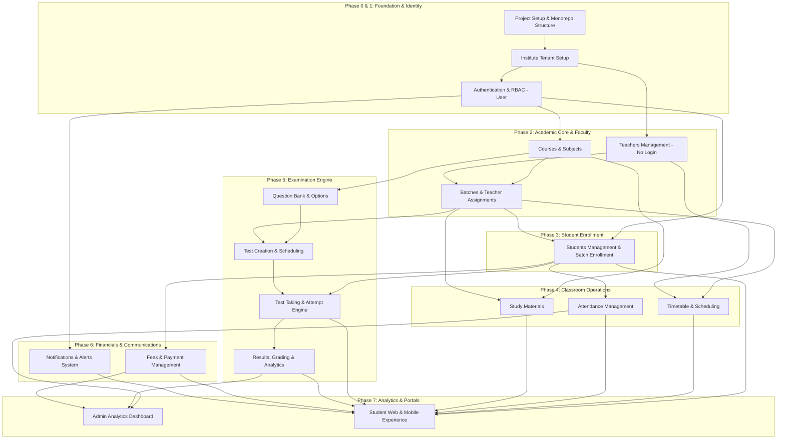

# Institute Management System — Module Dependency Order Specification
**Document Version:** 1.0.0  
**Phase:** Step 0.3 — Define Module Dependency Order  

---

## 1. Architectural Strategy & Ordering Rationale

Developing a scalable, robust, and decoupled management system requires a strictly sequential dependency order. 

Building higher-level operational modules (like *Attendance*, *Test Attempts*, or *Fee Invoices*) before core primitives (*Courses*, *Batches*, *Users*, and *Students*) creates orphan models and circular dependencies.

### Key Rules Followed:
1. **Core Infrastructure First:** Environment, database ORM, and root tenant (`Institute`) are established before business logic.
2. **Identity & Security Second:** Authentication and RBAC (`User` with `ADMIN` and `STUDENT` roles) secure all subsequent endpoints.
3. **Academic Primitives Third:** Curriculum (`Course`, `Subject`), Staff (`Teacher`), and Cohorts (`Batch`) must exist before student enrollment.
4. **Student Lifecycle Fourth:** Students link to `User` accounts and enroll in `Batches` via `StudentBatch`.
5. **Classroom Operations Fifth:** `Timetable`, `Attendance`, and `StudyMaterial` build directly on `Batch`, `Subject`, and `Student`.
6. **Examination Engine Sixth:** `QuestionBank` → `Tests` → `Attempts` → `Evaluation & Results`.
7. **Finance & Communication Seventh:** `Fee` structures, `Payments`, and `Notifications` integrate across all entities.
8. **Portals & Dashboards Final:** Aggregation, reporting, and full frontend/mobile view consumption.

---

## 2. Dependency Hierarchy Diagram



---

## 3. Phase-by-Phase Module Breakdown

---

### Phase 1: Foundation & Identity Infrastructure
*Required by every subsequent module.*

| Step / Module | Name | Entities Involved | Prerequisites | Outputs / Capabilities |
| :--- | :--- | :--- | :--- | :--- |
| **Module 0** | **Project Architecture & Workspace** | — | — | Monorepo/folder structure (`backend/`, `web/`, `mobile/`, `packages/`), configs, tooling. |
| **Module 1** | **Tenant (Institute) Setup** | `Institute` | Module 0 | Root institute entity, database connection, SaaS tenant boundary. |
| **Module 2** | **Authentication & RBAC** | `User` | Module 1 | JWT access/refresh token engine, password hashing (Argon2/bcrypt), Auth middleware (`ADMIN`, `STUDENT`), login/logout/profile APIs. |

---

### Phase 2: Academic Foundations & Faculty
*Sets up the curriculum and teaching staff.*

| Step / Module | Name | Entities Involved | Prerequisites | Outputs / Capabilities |
| :--- | :--- | :--- | :--- | :--- |
| **Module 3** | **Courses & Subjects** | `Course`, `Subject` | Module 2 | Course catalog, subject breakdown under courses, prerequisite tracking. |
| **Module 4** | **Teachers (Faculty)** | `Teacher`, `TeacherSubject` | Module 1, 3 | Faculty directory (no login credentials), teacher qualification mapping to subjects. |
| **Module 5** | **Batches & Assignments** | `Batch`, `TeacherAssignment` | Module 3, 4 | Cohort creation, assigning specific teachers to subjects in a batch. |

---

### Phase 3: Student Identity & Enrollment
*Brings students into the system with credentials and cohort placement.*

| Step / Module | Name | Entities Involved | Prerequisites | Outputs / Capabilities |
| :--- | :--- | :--- | :--- | :--- |
| **Module 6** | **Students & Enrollment** | `Student`, `StudentBatch` | Module 2, 5 | Student registration (auto-creates `User` login), batch enrollment, roll numbers, student profile management. |

---

### Phase 4: Daily Classroom Operations
*Operational workflows for active batches and enrolled students.*

| Step / Module | Name | Entities Involved | Prerequisites | Outputs / Capabilities |
| :--- | :--- | :--- | :--- | :--- |
| **Module 7** | **Timetable Management** | `Timetable` | Module 4, 5 | Weekly class schedule per batch/subject/teacher with classroom & online meeting link allocation. |
| **Module 8** | **Attendance Tracking** | `Attendance` | Module 5, 6 | Daily/period attendance logging, presence statistics, student absence history. |
| **Module 9** | **Study Materials** | `StudyMaterial` | Module 3, 5 | Resource uploading (PDFs, videos, notes) scoped to subject and optional batch. |

---

### Phase 5: Question Bank & Examination Engine
*Assessment lifecycle from authoring to student examination and analytics.*

| Step / Module | Name | Entities Involved | Prerequisites | Outputs / Capabilities |
| :--- | :--- | :--- | :--- | :--- |
| **Module 10** | **Question Bank** | `Question`, `QuestionOption` | Module 3 | Repository of single-choice, multiple-choice, numerical, and true/false questions categorized by subject & difficulty. |
| **Module 11** | **Test Creation & Scheduling** | `Test`, `TestQuestion` | Module 5, 10 | Exam builder, section configuration, mark allocation, window scheduling. |
| **Module 12** | **Exam Attempt Engine** | `TestAttempt`, `StudentAnswer` | Module 6, 11 | Secure online test interface, timer countdown, auto-save answers, submission pipeline. |
| **Module 13** | **Grading, Results & Analytics** | `Result` | Module 12 | Automated grading, rank calculation, percentile scoring, performance breakdown. |

---

### Phase 6: Financials & Communications
*Invoicing, payment collection, and notification triggers.*

| Step / Module | Name | Entities Involved | Prerequisites | Outputs / Capabilities |
| :--- | :--- | :--- | :--- | :--- |
| **Module 14** | **Fees & Payments** | `Fee`, `Payment` | Module 5, 6 | Fee structure generation per student/batch, discount handling, installment payments, receipt issuance. |
| **Module 15** | **Notifications System** | `Notification` | Module 2 | Real-time and in-app notifications for fee reminders, exam schedules, attendance alerts, and announcements. |

---

### Phase 7: Analytics, Dashboards & Client Portals
*Consolidating all data streams for role-specific interfaces.*

| Step / Module | Name | Entities Involved | Prerequisites | Outputs / Capabilities |
| :--- | :--- | :--- | :--- | :--- |
| **Module 16** | **Admin Analytics Dashboard** | All aggregates | Modules 1–15 | Overview metrics: active students, fee collections, attendance averages, upcoming tests, system health. |
| **Module 17** | **Student Web & Mobile Experience** | All student endpoints | Modules 6–15 | Complete student self-service portal (Web & Expo Mobile App) with private data scoping. |

---

## 4. Module Execution Summary Table

```
Step 0.1: Define Database Entities (Complete)
Step 0.2: Define Entity Relationships (Complete)
Step 0.3: Define Module Dependency Order (Complete)
───────────────────────────────────────────────────────────
Step 1.0: Project Structure Setup (Backend, Web, Mobile, Packages)
Step 2.0: Backend Base & Prisma Setup (Institute & User models)
Step 3.0: Authentication Module (Admin & Student Auth, JWT, RBAC)
Step 4.0: Courses & Subjects Module
Step 5.0: Teachers Management Module
Step 6.0: Batches & Teacher Assignments Module
Step 7.0: Students & Batch Enrollment Module
Step 8.0: Timetable Module
Step 9.0: Attendance Module
Step 10.0: Study Materials Module
Step 11.0: Question Bank Module
Step 12.0: Tests & Exam Management Module
Step 13.0: Test Attempt Engine & Online Testing
Step 14.0: Results, Grading & Student Performance Module
Step 15.0: Fees & Payments Module
Step 16.0: Notifications Module
Step 17.0: Admin Management Dashboard
Step 18.0: Student Web Portal & Mobile Application
```
